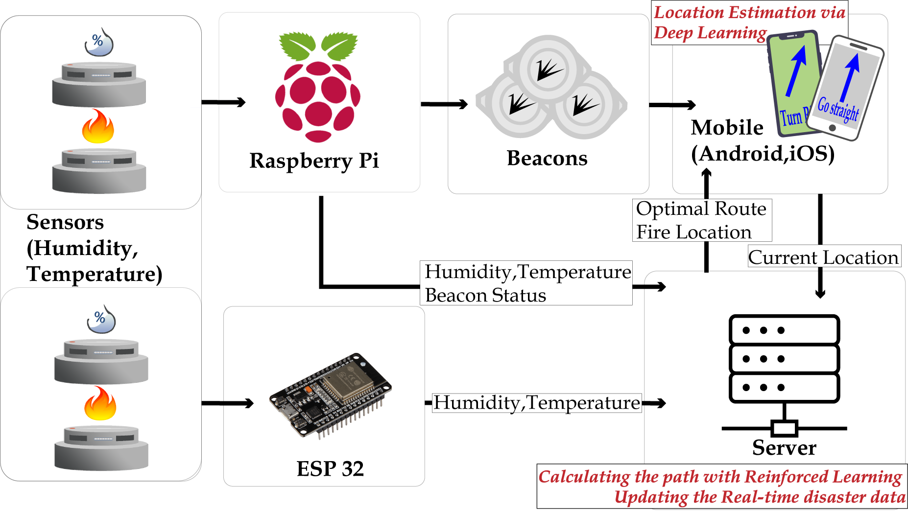

# BEST (Beacon-Based Evacuation System and Technology)

### 1. Group members
- Hwawon Lee
- Dohyun Chung
- Yoonha Bahng
- Jiwon Lim
- Suhyun Park
- Seongmin Kim
- Myong Oh

### 2. Group members University Information
- Soongsil University
- Chungang University
- Kwangwoon University
- Paichai University
- Kangwon National University
- Purdue University

### 3. Project Title (미정)
- Beacon-based Evacuation system & technology

### 4. Research problem statement
- TODO

### 5. Research novelty (Significance)
- **High accuracy** of indoor localization using iBeacon

- Server sends **optimized evacuation route** to exit in **Real-Time**

- **Intuitive Escape Route**: using Augmented Reality (AR) to easily follow shortest path

### 6. Overview or diagram visual

##### Raspberry pi ↔ Cloud Server
- Raspberry pi → Cloud Server
  - Detect the fire with the temperature sensor and the humidity sensor

  - Sends out a HTTP request to the server to notify the fire

- Cloud Server → Raspberry pi
  - Service Check

##### Access Point & Beacons → Smartphone
- Access Point & Beacons → Smartphone
  - The smartphone start to collect UUID, Major, Minor value of the beacons

  - Calculates the RSSI of the access point and the beacons

  - Filters the data by Kalman Filter

##### Smartphone ↔ Cloud Server
- Smartphone → Cloud Server
  - Sends user's location

- Cloud Server → Smartphone
  - Update the optimal evacuation route in real-time

### 7. Environment settings
- Raspberry pi

- iOS

- Android
  - Android Studio
  - [Altbeacon](https://altbeacon.github.io/android-beacon-library/)

/// 원본 ///
helps everyone evacuate. Easy to understand the way to escape while on Fire.

Using ARKit with iOS / Android

DO THE README SINCE MAY 30
